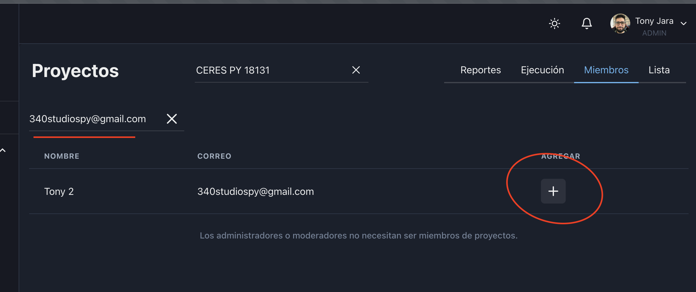

# Invitaciones

## Para que sirven?

Para que un usuario pueda interactuar con un proyecto, ya sea creando solicitudes o rendiciones, primero necesita ser parte del mismo.

:::note

Pueden invitar los usuarios con roles ADMIN o MODERATOR.
:::

:::info

Administradores y moderadores no necesitan ser invitados a proyectos.
:::

### Pasos para invitar a un usuario

**1-** Expandir el menú de organizacion, seleccionar la opción **Proyectos** y al estar dentro seleccionar la pestaña **Miembros** .

**2-** Seleccionar el proyecto al que se quiere añadir al nuevo usuario.

**3-** Ingresar el correo que con el que el usuario esta registrado en Jurumi en el campo donde dice ** Invite por correo elctrónico**.

**4-** Presionar el botón de a la de añadir (ver imagen para referencia).

:::info

Observaciones: Para que el correo del usuario salga dentro de la lista, se debe escribir el correo completo. Si no aparece en la lista, favor verificar que este escrito correctamente.
:::

### Desvincular de un proyecto.

Para revocar los permisos de un usuario dentro de un proyecto, seguimos los mismos pasos anteriores, con la excepción del último paso, donde en vez de ver un ícono de agregar, deberiamos ver el ícono de un basurero. Al presionar el botón, se desvincula al usuario del proyecto.
